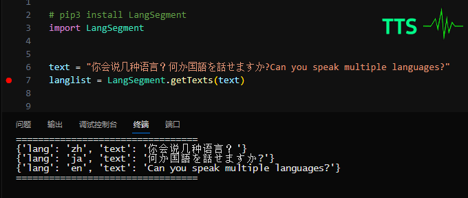
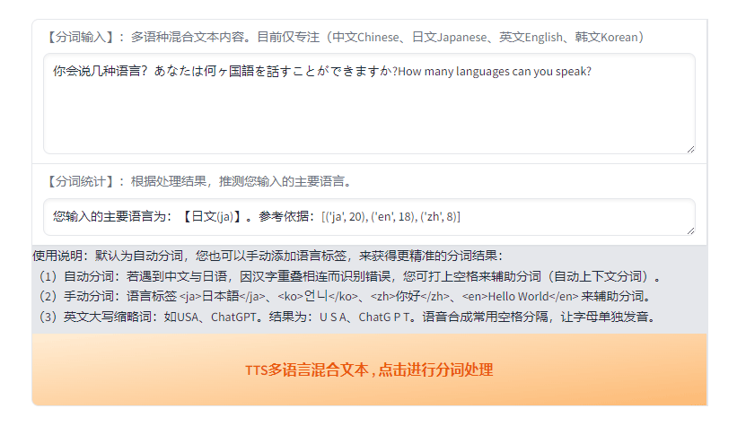

# LangSegment
**<font size=3 color='#00FFFF'>简介：它是一个强大的多语言（97种语言）的混合文本自动分词工具。[中/日/英/韩：已测试]</font>**   
**<font size=3 color='#00FFFF'>主要用途：“一口气” 让你的 TTS 语音合成项目 VITS 说出多国语言，多语种混合文本的分词推理，和预处理训练。</font>**   
**<font size=3 color='#00FFFF'>分词支持：中文/英文/日文/韩语/法语/越南语/俄语/泰语/</font>**   

   

它基于 py3langid 的扩展实现（>=python3.6）。  
``LangSegment`` It is a multi-lingual (97 languages) text content automatic recognition and segmentation tool.  
The main purposes are: front-end for various TTS (Text-to-Speech) synthesis projects, preprocessing of multilingual text mixing for both training and inference.  

>Implementation based on py3langid，See LICENSE file for more info.  
https://github.com/adbar/py3langid  


功能：将文章或句子里的例如（中/英/日/韩），按不同语言自动识别分词，使文本更适合AI处理。    
本代码专为各种 TTS 项目的前端文本多语种混合标注区分，多语言混合训练和推理而编写。

## 最近更新：News   
* 版本：v0.2.9     
* 添加支持： "zh"中文（数字拼音pinyin）保留。 
* 添加支持： "ru"俄语Russian / "th"泰语Thai。（更新帮助见下文）。
* 添加支持： "fr"法语French  / "vi"越南语Vietnamese。
* 语言优先级，置信度评分和阀值。
* 优化字符处理。fix: LangSegment.setfilters    
* 更细致的处理，中日英韩，分词更精准！  
* 多语言过滤组功能（默认:中/英/日/韩）！帮您自动清理不需要的语言内容。   
* 添加 WebUI 可视化界面，运行 app.py 即可快捷体验（如图所示）。  

* <a href='https://huggingface.co/spaces/sunnyboxs/LangSegment'><u>点击在线体验，感谢 huggingface 提供服务支持</u>：</a>

   

```python
# Gradio demo：To use our gradio demo locally:
# 运行脚本，打开浏览器 gradio webui 界面，开始快速体验。(gradio==3.50.2)
python app.py  
```

## 完全可控：支持    
* （1）自动分词：“韩语中的오빠读什么呢？あなたの体育の先生は誰ですか? 此次带来了四款iPhone 15系列机型”     
* （2）手动分词：“你的名字叫\<ja\>佐々木？\<ja\>吗？”  

## 语言标签：支持  
>分词语言标签：它和html类似，它需要成对出现 \<zh\>内容\<zh\>  或者  \<zh\>内容\</zh\>。    
本处理结果主要针对（中文=zh , 日文=ja , 英文=en , 韩语=ko）, 实际上可支持多达 97 种不同的语言混合处理。    

## 安装方法：Install  (推荐使用官方源)
```bash
# 首次安装：官方源（推荐）
pip3 install LangSegment -i  https://pypi.org/simple
# 后续版本升级或更新：
pip3 install LangSegment -i  https://pypi.org/simple --upgrade

# 或者，国内镜像（国内镜像同步慢几天，可能会导致您无法极时获得最新版本！！！）：  
# pip3 install LangSegment -i https://pypi.mirrors.ustc.edu.cn/simple
```
## 使用示例：Example Input  
>示例中的句子，同时包含中日英韩4种语言，接下来将对它们按不同语种进行分词，以方便各种TTS项目进行语音合成。  
```python

    # pip3 install LangSegment -i  https://pypi.org/simple
    import LangSegment

    # input text example 示例：
    text = "你的名字叫<ja>佐々木？<ja>吗？韩语中的오빠读什么呢？あなたの体育の先生は\
    誰ですか? 此次发布会带来了四款iPhone 15系列机型\
    和三款Apple Watch等一系列新品，这次的iPad Air采用了LCD屏幕" 

    # example
    langlist = LangSegment.getTexts(text)

    # output list : {'lang': 'zh', 'text': '...'}
    print("=================================")
    for line in langlist:
        print(line)
    print("=================================")
```
## 处理结果：Example Output  
```python
    # output 输出列表行：lang=语言，text=内容
    # ===========================================================================
    # {'lang': 'zh', 'text': '你的名字叫'}
    # {'lang': 'ja', 'text': '佐々木？'}
    # {'lang': 'zh', 'text': '吗？韩语中的'}
    # {'lang': 'ko', 'text': '오빠'}
    # {'lang': 'zh', 'text': '读什么呢？'}
    # {'lang': 'ja', 'text': 'あなたの体育の先生は誰ですか?'}
    # {'lang': 'zh', 'text': ' 此次发布会带来了四款'}
    # {'lang': 'en', 'text': 'i Phone'}
    # {'lang': 'zh', 'text': ' 15系列机型和三款'}
    # {'lang': 'en', 'text': 'Apple Watch'}
    # {'lang': 'zh', 'text': '等一系列新品，这次的'}
    # {'lang': 'en', 'text': 'i Pad Air'}
    # {'lang': 'zh', 'text': '采用了'}
    # {'lang': 'en', 'text': 'L C D'}
    # {'lang': 'zh', 'text': '屏幕'}
    # ===========================================================================
    # 其中英文缩写字母如“LCD”，英文标准发音为“L-C-D”，
    # 而在语音合成TTS项目中，一般用空格隔开字母来单独发音：“L C D”
```

## 拼读规则：支持  
```python
TTS语音合成（英文字母）大小写拼读规则：
（1）需要单个字母发音就大写，比如：USA，USB，ChatGPT，LCD，GPU，CEO。
（2）其它情况正常拼读，就按正常拼写。比如：Nvidia ， Cuda 或者全小写 （nvidia ， cuda ）
```

## 分词纠错：很重要！
>综上所述，“自动分词”已经极大的提高了我们的工作效率，但还是建议您对分词结果进行人工校对。    
特别是中文与日文，存在大量汉字互用，这对自动分词是极具挑战性的，“分词纠错” 解决方案如下：


* （1）自动分词纠错：在中文与日文句子之间，打上空格来辅助分词（自动上下文分词）。   
* （2）手动分词纠错：您可手动添加语言标签\<ja\>,\<ko\>,\<zh\>,\<en\>等来辅助进行强制分词。    

以下是语言标签分词详细示例：   
```python
    # 手动分词标签的应用示例，例如针对中日汉字有重叠，而需要在 TTS 中混合发音的情况：
    # 分词标签内的文本将识别成日文ja内容，也可以写成<ja>内容</ja>
    text = "你的名字叫<ja>佐々木？<ja>"  
    # 或者：
    text = "你的名字叫<ja>佐々木？</ja>"  
    # 以上均能正确输出：
    # 处理成中文-- {'lang': 'zh', 'text': '你的名字叫'}
    # 处理成日文-- {'lang': 'ja', 'text': '佐々木？'}
```
自动分词能力目前主要针对中文(zh)/日文(ja)/英文(en)/韩文(ko)，进行了特别优化。  
它特别适合各种 TTS 前端文本多语种内容的混合分词（自动/手动），训练和推理使用。  

```python
    # 手动分词标签规范：<语言标签>文本内容</语言标签>
    # ===========================================================================
    # 如需手动标注，标签需要成对出现，如：“<ja>佐々木<ja>”  或者  “<ja>佐々木</ja>”
    # 错误示范：“你的名字叫<ja>佐々木。” 此句子中出现的单个<ja>标签将被忽略，不会处理。
    # ===========================================================================
```  

## 语言过滤：支持
> 版本支持：>=0.2.0   
语言过滤组功能, 可以指定保留语言。不在过滤组中的语言将被清除。您可随心搭配TTS语音合成所支持的语言。  
```python
# Set language filters
# 设置语言过滤功能，未指定的语言将被清除，使它完全适配您的TTS项目。
LangSegment.setfilters(["zh", "en", "ja", "ko"]) # 标准写法
# 或者写成：
# LangSegment.setfilters(["zh_en_ja_ko"]) # 写法1，过滤效果相同
# LangSegment.setfilters(["zh-en-ja-ko"]) # 写法2，过滤效果相同
# 获取过滤器：
# LangSegment.getfilters()

# 参数组合说明，以下是部份场景示例：
# ["zh"]        # 按中文识别
# ["en"]        # 按英文识别
# ["ja"]        # 按日文识别
# ["ko"]        # 按韩文识别
# ["zh_ja"]     # 中日混合识别
# ["zh_en"]     # 中英混合识别
# ["zh_ko"]     # 中韩混合识别
# ["ja_en"]     # 日英混合识别
# ["zh_ko_en"]  # 中韩英混合识别
# 以上是示例，您可根据自己的TTS项目进行自由组合。
```  
## 语言优先级：支持（纯数字输入示例）
> 版本支持：>=0.2.1   
当我们在鉴别纯数字时，比如“123456”，全球通用。如果没有提供上下文，将无法区分归属（默认en）。  
这时候，您只需调整语言优先级。就能准确识别。相关示例如下：

```python
# 仅输入独立纯数字：所有国家通用，因为没有提供上下文，所以无法区分语言归属
print(LangSegment.getTexts("123456789")) # 国际纯数字，默认输出：英文=en

# 调整过滤语言优先级，中文优先，数字按中文优先识别
LangSegment.setfilters(["zh","ja"])
print(LangSegment.getTexts("123456789")) # 识别输出：中文=zh

# 调整过滤语言优先级，日语优先，数字按日语优先识别
LangSegment.setfilters(["ja","zh"])
print(LangSegment.getTexts("123456789")) # 识别输出：日文=ja

# 调整过滤语言优先级，韩语优先，数字按韩语优先识别
LangSegment.setfilters(["ko","zh"])
print(LangSegment.getTexts("123456789")) # 识别输出：韩文=ko  

# 识别输出：中文，（因为提供了上下文，汉字“编号：”）
LangSegment.setfilters(["ko","zh","en","ja"])
print(LangSegment.getTexts("编号：123456789"))  # 提供上下文，识别输出：中文=zh  
print(LangSegment.getTexts("Number：123456789"))  # 提供上下文，识别输出：英文=en  
print(LangSegment.getTexts("번호：123456789"))  # 提供上下文，识别输出：韩文=ko  
```   
## 优先级与置信度：特殊示例
> 版本支持：>=0.2.1   
语言优先级除了对输入的纯数字外，它对中文与日文也特别有用，以下是使用示例：   

* 示例汉字词：“番号”，由于在中文和日语，两者使用几乎完全一样，在中日混合模式下。   
```python
# 在中日混合下，默认情况为中文优先。
LangSegment.setfilters(["zh","ja","en","ko"])
# 默认处理：
print(LangSegment.getTexts("番号: 123456789"))  
# [{'lang': 'zh', 'text': '番号: 123456789 ', 'score': 0.87188566}]
# 默认识别：中文=zh ，识别的参考置信度是：0.87
``` 
* 而此时，在中日混合模式下，我们希望它识别成：日语=ja。 
```python
# 只需按如下调整过滤器的语言优先级。让 ja 优先于 zh 之前。
LangSegment.setfilters(["ja","zh","en","ko"])
# 再次处理：
print(LangSegment.getTexts("番号: 123456789"))  
# [{'lang': 'ja', 'text': '番号: 123456789 ', 'score': 0.87188566}]
# 阀值的精准控制下，它被优先识别为我们希望的结果：日文=ja  

# 您还可以添加语言标签：精准控制
print(LangSegment.getTexts("<ja>番号: 123456789</ja>")) 
# 添加语言标签，正确输出：日文=ja
```   

## 预览新增：法语(French)/越南语(Vietnamese)/俄语(Russian)/泰语(Thai)
> 版本支持：>=0.2.2 (法语(French)/越南语(Vietnamese))  
> 版本支持：>=0.2.3 (俄语(Russian)/泰语(Thai))  
> 法语和越南语，您只需在语言过滤器中添加，即可配合分词标签使用。

```python
# 自动分词启用设置：法语="fr" , 越南语="vi", "ru"俄语=Russian, "th"泰语=Thai
LangSegment.setfilters(["fr", "vi" , "zh", "ja", "ko", "en"])

# 可以随意搭配，比如您的TTS只需（越南语/中文），则仅需保留两个语言。
# LangSegment.setfilters(["vi" , "zh"])

# 对应的（法语fr和越南语vi）手动分词语言标签：
# <fr>Français</fr>、<vi>Tiếng Việt</vi>
```  
>每个语种它们对应的语言分词标签： (ISO 639-1 codes given)：
>* \<zh\>：中文 = Chinese  
>* \<en\>：英语 = English  
>* \<ja\>：日语 = Japanese  
>* \<ko\>：韩语 = Korean  
>* \<fr\>：法语 = French  
>* \<vi\>：越南语 = Vietnamese  
>* \<ru\>：俄语 = Russian  
>* \<th\>：泰语 = Thai     
>* 更多其它97个语种标签，在下方完整列表已经列出。    


## 总结说明：  
它经过了高达 97 种语言的预训练，相信它绝对能满足您的 TTS 语音合成项目所需。    
comes pre-trained on 97 languages (ISO 639-1 codes given):  
>af, am, an, ar, as, az, be, bg, bn, br, bs, ca, cs, cy, da, de, dz, el, en, eo, es, et, eu, fa, fi, fo, fr, ga, gl, gu, he, hi, hr, ht, hu, hy, id, is, it, ja, jv, ka, kk, km, kn, ko, ku, ky, la, lb, lo, lt, lv, mg, mk, ml, mn, mr, ms, mt, nb, ne, nl, nn, no, oc, or, pa, pl, ps, pt, qu, ro, ru, rw, se, si, sk, sl, sq, sr, sv, sw, ta, te, th, tl, tr, ug, uk, ur, vi, vo, wa, xh, zh, zu  


---
---
> 备注：多语种混合文本转语音合成（TTS），中/日/英/韩/已完成测试。  
其它语种未作具体测试，如有Bug和优化建议，欢迎提出或指正，感谢~。  
Note: The speech synthesis test content is currently mainly for four categories: Chinese, Japanese, English and Korean.     
Other languages have not been specifically tested. If there are any bugs or optimization suggestions, please feel free to raise them or correct them. Thank you~  
Special thanks to the following projects: [py3langid](https://github.com/adbar/py3langid)
---
---